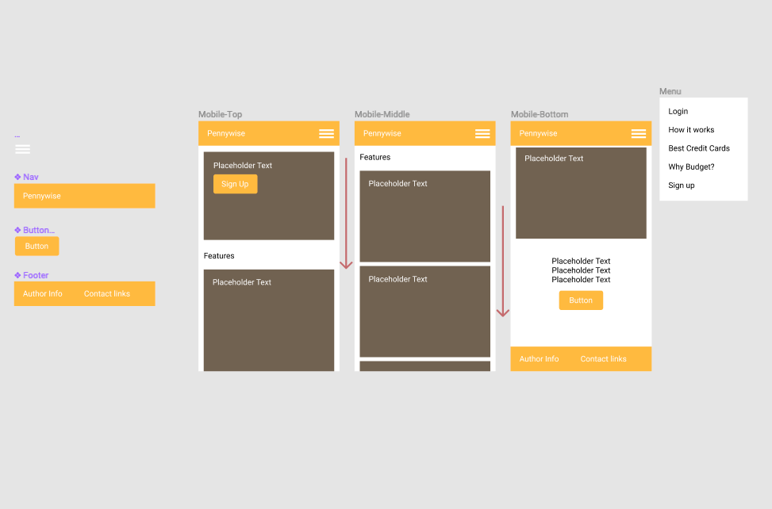
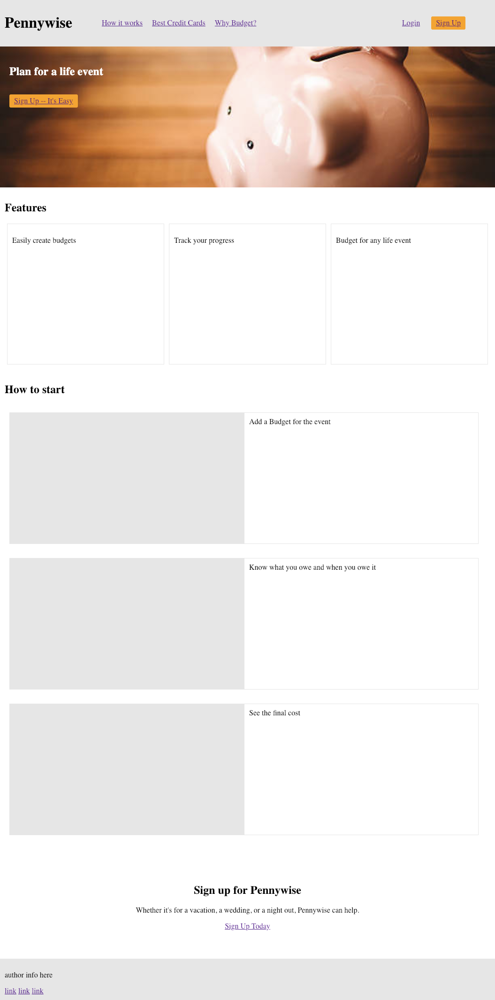

## Pennywise -- Budget app
Budget for your special life event.

#### Screenshots

#### User Cases

#### User Stories

* As a user, I should be able to login so that I may use Pennywise.

#### User Flow & Wireframe

Mockup & Wireframing

Mobile

Wireframing for Desktop

#### Working Prototype

Demo here

#### Functionality

The app's functionality includes:

#### Technology
Frontend: React.js | Redux | CSS3 | JavaScript ES6  
Backend: Node.js | Express.js
Testing: Mocha | Chai  
Database: MongoDB | Mongoose  
Security: bcrypt.js, JWT, Passport.js  

#### Responsive
App is responsive across most mobile, tablet, laptop, and desktop screen resolutions.

#### Development Roadmap
This is v1.0 of the app, but future enhancements may include:

##### v2
